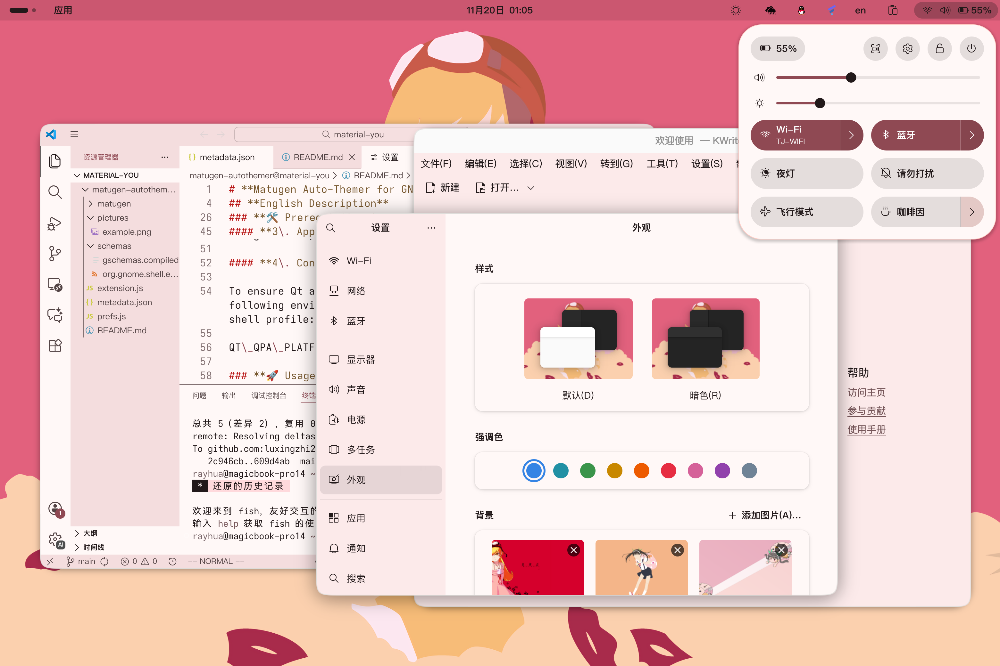
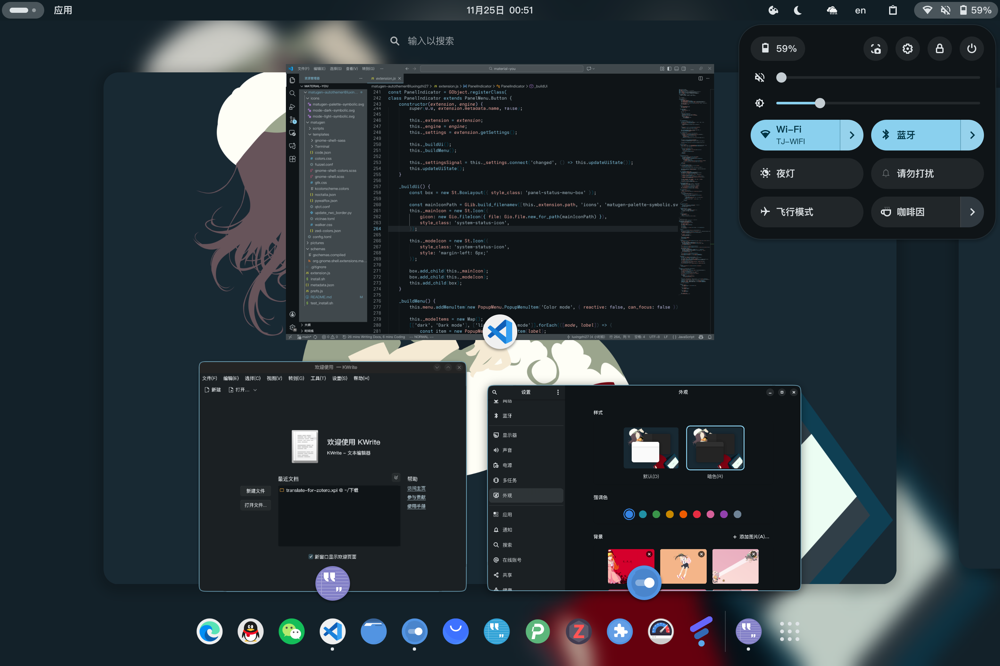

# **Matugen Auto-Themer for GNOME**
 

## **English Description**

**Matugen Auto-Themer** is a powerful GNOME Shell extension that brings Material You (Material Design 3\) coloring to your entire Linux desktop. It watches for wallpaper changes or mode switches (Light/Dark) and automatically uses [Matugen](https://github.com/InioX/matugen) to generate and apply cohesive color schemes across your system.

### Declaration

Some of Matugen's templates and configurations use the configuration of [Noctalia Shell](https://github.com/noctalia-dev/noctalia-shell).

### **🎨 Supported Theming Scope**

This extension goes beyond just the shell. Based on the configuration, it generates and applies themes for:

* **GNOME Shell**: Full Material You coloring for the top panel, quick settings, overview, and popups.  
* **GTK 4 & GTK 3**: Applies colors to Libadwaita apps and legacy GTK apps (requires adw-gtk3).  
* **Qt 5 & Qt 6**: Themed via qt5ct and qt6ct.  
* **Terminals**: Ghostty.  
* **Launchers**: Fuzzel, Walker.  
* **Applications**:  
  * VSCode & Zed Editor  
  * Firefox (via Pywalfox)  
  * Vicinae

### **🛠️ Prerequisites & Setup (Important)**

Before enabling the extension, you must perform a few manual steps to ensure the themes apply correctly.

#### **1\. Install Dependencies**

Ensure you have the following installed on your system:

* matugen (The color generation tool)  
* sassc (Required to compile the GNOME Shell theme)  
* adw-gtk3 theme (For legacy GTK application styling)  
* qt5ct and qt6ct (For Qt application styling)

#### **2\. Prepare the GNOME Shell Theme Folder**

The extension compiles the shell theme into a specific local directory. You must create this directory manually:

```
mkdir -p ~/.local/share/themes/Material/gnome-shell
```

#### **3\. Apply Base Themes**

Open **GNOME Tweaks** (or use gsettings) and set the following:

1. **Shell Theme**: Select Material (User Themes extension required).  
2. **Legacy Applications**: Select adw-gtk3 (or adw-gtk3-dark).

#### **4\. Configure Qt**

To ensure Qt apps use the generated colors, add the following environment variable to your /etc/environment or shell profile:

```
QT\_QPA\_PLATFORMTHEME=qt5ct
```

And you also need to set the color scheme in qt5ct/qt6ct to "noctalia". To get the best experience, you can use the [darkly](https://github.com/Bali10050/Darkly) application style in qt5ct/qt6ct.

#### **5\. Configure VScode**
To ensure VScode uses the generated colors, you need to install the "HyprLuna Matugen Theme" extension and set the color theme to "Hyprluna".

### **🚀 Usage**

1. **Install the Extension**: Copy the extension folder to `~/.local/share/gnome-shell/extensions/`.  
2. **Compile Schemas**:  
   ```
   glib-compile-schemas schemas
   ```

3. **Enable**: Restart GNOME Shell (Log out/in) and enable the extension.  
4. **Customize**:  
   * Use the **Panel Indicator** to toggle between Light/Dark mode.  
   * Select your preferred **Color Flavor** (e.g., Tonal Spot, Vibrant, Fruit Salad).  
   * Change your **Wallpaper**, and the entire system theme will update automatically\!

## **中文说明**

**Matugen Auto-Themer** 是一个强大的 GNOME Shell 扩展，旨在为您的 Linux 桌面带来全局的 Material You (Material Design 3\) 动态配色体验。它会监听壁纸更换或明暗模式的切换，并自动调用 [Matugen](https://github.com/InioX/matugen) 生成并应用统一的配色方案。

### 声明
matugen的部分模板和配置使用了[noctalia shell](https://github.com/noctalia-dev/noctalia-shell)的配置。

### **🎨 自动配色范围**

本插件不仅限于美化 GNOME Shell，它还可以根据配置文件为以下组件生成并应用主题：

* **GNOME Shell**: 顶栏、快速设置面板、概览和弹出菜单的完整 Material You 配色。  
* **GTK 4 & GTK 3**: 适配 Libadwaita 应用及传统 GTK 应用（依赖 adw-gtk3）。  
* **Qt 5 & Qt 6**: 通过 qt5ct 和 qt6ct 应用配色。  
* **终端模拟器**: Ghostty。  
* **启动器**: Fuzzel, Walker。  
* **常用应用**:  
  * VSCode 和 Zed 编辑器  
  * Firefox 浏览器 (需配合 Pywalfox)  
  * Vicinae

### **🛠️ 前置要求与设置（重要）**

在启用插件之前，您必须手动完成以下步骤，以确保存储路径存在且主题能够被正确应用。

#### **1\. 安装必要的依赖**

请确保您的系统中已安装以下工具或主题：

* matugen (核心配色生成工具)  
* sassc (用于编译 GNOME Shell 主题样式表)  
* adw-gtk3 主题 (用于统一 GTK3 应用的样式)  
* qt5ct 和 qt6ct (用于管理 Qt 应用样式)

#### **2\. 创建 GNOME Shell 主题目录**

插件会将编译好的 Shell 主题输出到本地主题目录，您需要手动创建该文件夹：

```
mkdir \-p \~/.local/share/themes/Material/gnome-shell
```

#### **3\. 应用基础主题**

打开 **GNOME Tweaks（优化）** 工具（或使用 gsettings）进行以下设置：

1. **Shell 主题 (Shell Theme)**: 选择 Material（需要先启用 User Themes 扩展）。  
2. **过时应用程序 (Legacy Applications)**: 选择 adw-gtk3（或 adw-gtk3-dark）。

#### **4\. 配置 Qt 环境**

为了让 Qt 应用读取生成的颜色配置，请将以下环境变量添加到您的 /etc/environment 或 Shell 配置文件中：

```
QT\_QPA\_PLATFORMTHEME=qt5ct
```

同时，您还需要在 qt5ct/qt6ct 中将配色方案设置为 "noctalia"。为了获得最佳体验，您可以在 qt5ct/qt6ct 中使用 [darkly](https://github.com/Bali10050/Darkly) 应用样式。

#### **5\. 配置 VScode**
为了让 VScode 使用生成的配色，您需要安装 "HyprLuna Matugen Theme" 扩展，并将配色主题设置为 "Hyprluna"。

### **🚀 使用方法**

1. **安装扩展**: 将插件目录复制到 `~/.local/share/gnome-shell/extensions/`。  
2. 编译 Schema:  
   进入扩展目录并运行：  
   ```
   glib-compile-schemas schemas
   ```

3. **启用扩展**: 重启 GNOME Shell（注销并重新登录），然后在扩展管理器中启用它。  
4. **个性化**:  
   * 点击顶栏的 **Matugen 图标** 快速切换 明亮/暗黑 模式。  
   * 在菜单中选择喜欢的 **配色风格 (Scheme type)**（如：Tonal Spot, Vibrant 等）。  
   * **更换壁纸**，系统配色将即刻自动更新！
